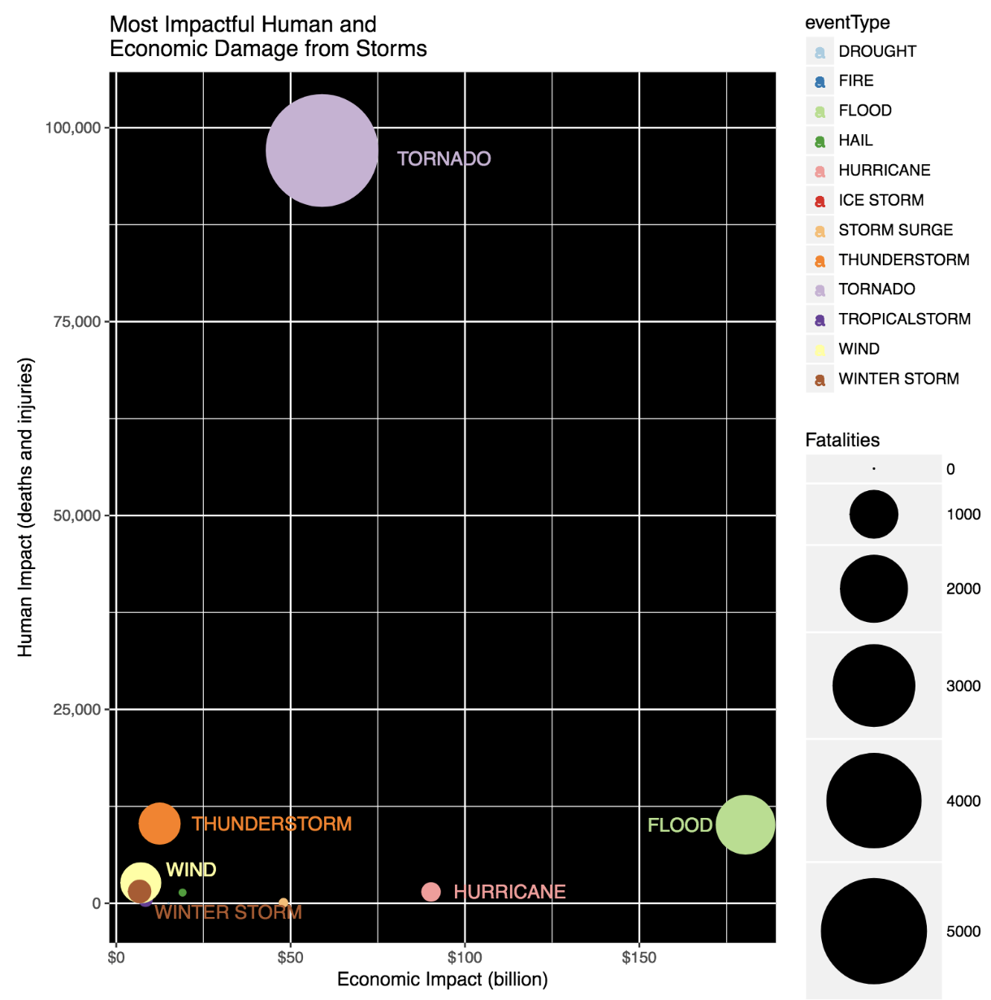

```{r setup, include=FALSE}
knitr::opts_chunk$set(echo = FALSE)
```

## Page 1 - introduction

Welcome everyone who loves interactive data and especially, to you weather geeks out there!

<center>

</center>

## Page 2 - the problem

How many times have you seen an awesome chart or graph and wanted to adjust or manipulate the view?


## Page 3 - the problem illustrated



Wouldn't it be great if you could zoom in?  Filter and select which data to view?

## Page 4 - the solution

```{r load-clean-graph, echo=FALSE, message=FALSE, warning=FALSE}

library(readr)
library(stringr)
library(dplyr)
library(formattable)
library(plotly)

if(!file.exists("data")){dir.create("data")}

stormDestFile <- "data/StormEvents_details-ftp_v1.0_d2017_c20180718.csv"

if(!file.exists(stormDestFile)) {
  fileUrl <- "https://www1.ncdc.noaa.gov/pub/data/swdi/stormevents/csvfiles/StormEvents_details-ftp_v1.0_d2017_c20180718.csv.gz"
  download.file(fileUrl,destfile="data/StormEvents_details-ftp_v1.0_d2017_c20180718.csv.gz",method="curl")
  gunzip("data/StormEvents_details-ftp_v1.0_d2017_c20180718.csv.gz")
}

Storm_Data <- read_csv(file="data/StormEvents_details-ftp_v1.0_d2017_c20180718.csv")

# Clean up Storm_Data and compute multipliers for ecomomic damage as dollar amounts

# Process economic damage
Storm_Data$DAMAGE_PROPERTY[is.na(Storm_Data$DAMAGE_PROPERTY)] <- "0.00K" # remove NAs
exp_pattern <- '[a-zA-Z]'
Storm_Data$DAMAGE_PROPERTYEXP <- str_extract(Storm_Data$DAMAGE_PROPERTY, exp_pattern)
Storm_Data$DAMAGE_PROPERTYEXP <- as.factor(Storm_Data$DAMAGE_PROPERTYEXP)
PROPERTYEXP <- levels(Storm_Data$DAMAGE_PROPERTYEXP)
pMultiplier <- c(10000000,1000,1000000)
propLookup  <- data.frame(cbind(PROPERTYEXP,pMultiplier))
propLookup$pMultiplier <- as.numeric(as.character(propLookup$pMultiplier))
Storm_Data <- merge(Storm_Data,propLookup)
Storm_Data$DAMAGE_PROPERTYNUM <- as.numeric(str_extract(Storm_Data$DAMAGE_PROPERTY, "\\d+\\.*\\d*"))
Storm_Data$totalPropDamage <- Storm_Data$DAMAGE_PROPERTYNUM*Storm_Data$pMultiplier

Storm_Data$DAMAGE_CROPS[is.na(Storm_Data$DAMAGE_CROPS)] <- "0.00K" # remove NAs
Storm_Data$DAMAGE_CROPSEXP <- str_extract(Storm_Data$DAMAGE_CROPS, exp_pattern)
Storm_Data$DAMAGE_CROPSEXP <- as.factor(Storm_Data$DAMAGE_CROPSEXP)
CROPEXP <- levels(Storm_Data$DAMAGE_CROPSEXP)
pMultiplier <- c(10000000,1000,1000000)
propLookup  <- data.frame(cbind(CROPEXP,pMultiplier))
propLookup$pMultiplier <- as.numeric(as.character(propLookup$pMultiplier))
Storm_Data <- merge(Storm_Data,propLookup)
Storm_Data$DAMAGE_CROPNUM <- as.numeric(str_extract(Storm_Data$DAMAGE_CROPS, "\\d+\\.*\\d*"))
Storm_Data$totalCropDamage <- Storm_Data$DAMAGE_CROPNUM*Storm_Data$pMultiplier
Storm_Data$totalDamage <- Storm_Data$totalPropDamage + Storm_Data$totalCropDamage

# plot

df_storms <- Storm_Data  %>%
  filter(STATE %in% 'CALIFORNIA')

stormData <- dplyr::select(df_storms, EVENT_TYPE, STATE, DEATHS_DIRECT, DEATHS_INDIRECT, INJURIES_DIRECT, INJURIES_INDIRECT, totalPropDamage, totalCropDamage, totalDamage)
      
# Compute human damage
topHumanDirectFatalities <- stormData %>% group_by(EVENT_TYPE) %>% summarise(sumHumanDirectFatalities=sum(DEATHS_DIRECT)) %>% arrange(desc(sumHumanDirectFatalities))
topHumanIndirectFatalities <- stormData %>% group_by(EVENT_TYPE) %>% summarise(sumHumanIndirectFatalities=sum(DEATHS_INDIRECT)) %>% arrange(desc(sumHumanIndirectFatalities))
topHumanDirectInjuries <- stormData %>% group_by(EVENT_TYPE) %>% summarise(sumHumanDirectInjuries=sum(INJURIES_DIRECT)) %>% arrange(desc(sumHumanDirectInjuries))
topHumanIndirectInjuries <- stormData %>% group_by(EVENT_TYPE) %>% summarise(sumHumanIndirectInjuries=sum(INJURIES_INDIRECT)) %>% arrange(desc(sumHumanIndirectInjuries))

# Combine all top damage data sets
allHumanDamage <- merge(topHumanDirectFatalities, topHumanIndirectFatalities)
allHumanDamage <- merge(allHumanDamage, topHumanDirectInjuries)
allHumanDamage <- merge(allHumanDamage, topHumanIndirectInjuries)
allHumanDamage$sumHumanImpact <- allHumanDamage$sumHumanDirectFatalities + allHumanDamage$sumHumanIndirectFatalities + allHumanDamage$sumHumanDirectInjuries + allHumanDamage$sumHumanIndirectInjuries
      
# generate top economic damage
topEconDamage <- stormData %>% group_by(EVENT_TYPE) %>% summarise(sumTotalDamage=sum(totalDamage)) %>% arrange(desc(sumTotalDamage))
topEconDamage$sumTotalDamage <- currency(topEconDamage$sumTotalDamage, symbol = "$")
      
# Combine all top damage data sets
allDamage <- merge(allHumanDamage, topEconDamage)
      
plot_ly(allDamage, x = ~sumHumanDirectFatalities, y = ~sumHumanDirectInjuries, z = ~sumTotalDamage, color = ~EVENT_TYPE, colors = c('#BF382A', '#0C4B8E')) %>%
        add_markers() %>%
        layout(scene = list(xaxis = list(title = 'Human Fatalities'),
                            yaxis = list(title = 'Human Injuries'),
                            zaxis = list(title = 'Economic Damage')))
```
Well, now's your chance!  Go on, click it, twirl it, rotate...Go crazy!

## Page 5 - summary/refs/links

Now that you've had a small taste, head on over to the [complete app](https://balexander123.shinyapps.io/DDP_Week4_project/) in all its amazing glory!

[Source Code](https://github.com/balexander123/DDP_Week4_project)

[Inquire about my availability for interesting data science or analytics projects](https://www.linkedin.com/in/barry-alexander-9169553/)

<center>
THANK YOU!!!
</center>